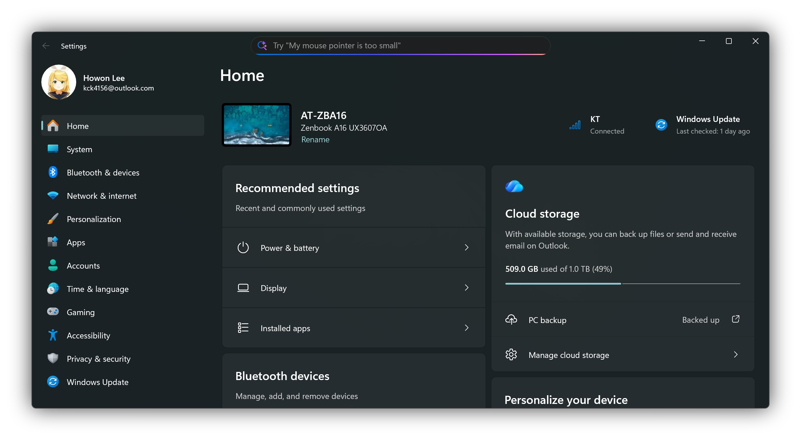

# CrispShot

🌐 [English](README.md)

CrispShot는 Windows의 `Alt` + `Print Screen` 캡처 시 활성 창 주변에 배경이 함께 캡처되던 불편함을 해결하는 가벼운 Windows 트레이 유틸리티입니다.
활성 창만 깔끔하게 캡처하고, 선택적으로 그림자를 적용하여 바로 공유할 수 있는 미려한 창 스크린샷을 만들어줍니다.

## 주요 기능

- `Alt` + `Print Screen`으로 활성 창 즉시 캡처
- 강도 조절이 가능한 부드러운 그림자 효과 (꺼짐, 적게, 중간, 많이)
- 카카오톡 전용 클립보드 포맷 지원으로 붙여넣을 때 투명도 유지
- WGC로 캡처할 수 없는 창은 OS 클립보드 결과 유지
- 시스템 시작 시 자동 실행
- 관리자 권한으로 실행된 프로그램의 창도 캡처할 수 있도록 관리자 권한 실행 옵션 지원
- 보이는 창 없이 트레이에서만 동작
- 다국어 UI 지원 (영어, 한국어, 일본어, 중국어 간체, 중국어 번체)

## 사용 라이브러리

- [Microsoft.WindowsAppSDK](https://github.com/microsoft/WindowsAppSDK) - WinUI 3 앱 플랫폼과 Windows 통합 기능
- [SkiaSharp](https://github.com/mono/SkiaSharp) - 알파 인식 이미지 렌더링 및 그림자 합성
- [DevWinUI.Controls](https://github.com/ghost1372/DevWinUI) - 트레이 아이콘 통합
- [TaskScheduler](https://github.com/dahall/TaskScheduler) - 관리자 모드를 위한 작업 스케줄러 관리
- [Microsoft.Windows.CsWin32](https://github.com/microsoft/CsWin32) - 소스 생성 기반 Win32 P/Invoke 바인딩

## 라이선스

이 프로젝트는 [MIT 라이선스](LICENSE.txt)로 배포됩니다.

## 감사의 글 (Acknowledgement)

Windows Graphics Capture 구현은 [robmikh/Win32CaptureSample](https://github.com/robmikh/Win32CaptureSample)을 참고하였습니다.

## 작성자

**이호원** ([airtaxi](https://github.com/airtaxi))
